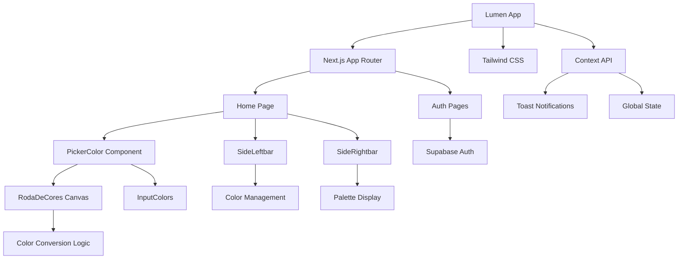

# 🌟 Lumen

### ✨ Uma ferramenta elegante e intuitiva para designers e desenvolvedores explorarem e manipularem cores na web

  

  Plataforma de alta performance para seleção, conversão e gerenciamento de cores, construída com tecnologias modernas para uma experiência fluida e responsiva.

  
  
  
  
  

---

## 🎥 Demonstração

  

  

---

## 📖 Visão Geral

Lumen é uma aplicação web moderna projetada para simplificar o trabalho com cores para designers e desenvolvedores. Oferece uma interface intuitiva e ferramentas essenciais para seleção visual, conversão de formatos e gerenciamento de paletas, tudo rodando 100% no navegador com máxima performance.

---

## ✨ Funcionalidades

Lumen foi desenvolvido para atender às necessidades de profissionais criativos, proporcionando uma experiência de usuário fluida e eficiente:

| Funcionalidade | Descrição | Benefício |
| -------------- | --------- | --------- |
| 🎨 **Seletor de Cor Interativo** | Roda de cores customizada com Canvas para seleção precisa e visual de matiz, saturação e luminosidade | Seleção intuitiva e visual de cores |
| 🔄 **Conversão de Formatos** | Suporte completo e em tempo real para HEX, RGB, HSL e CMYK | Facilita integração em projetos |
| 💾 **Salvamento de Paletas** | Sistema para salvar e gerenciar paletas de cores personalizadas | Organização e reutilização de cores |
| 🎨 **Criação de Gradientes** | Ferramentas para gerar gradientes visuais e exportá-los em CSS | Design visual avançado |
| ♿ **Verificação de Acessibilidade** | Análise de contraste WCAG para acessibilidade | Conformidade com padrões web |
| 📱 **Interface Responsiva** | Layout adaptável para desktop e mobile | Experiência consistente |
| 🌙 **Tema Claro/Escuro** | Alternância de temas com persistência | Adaptação às preferências |
| 👤 **Autenticação** | Sistema completo de login e registro com Supabase | Personalização e segurança |
| 🔔 **Notificações** | Sistema de notificações toast globais | Feedback imediato |
| 📄 **Página 404** | Experiência de erro elegante | Navegação consistente |

---

## 🏗️ Arquitetura do Projeto

---

## ✨ Destaques Técnicos

Lumen combina arquitetura robusta com decisões técnicas estratégicas para entregar alta performance e escalabilidade:

- 🚀 **Next.js com App Router**: Estrutura moderna para roteamento eficiente e carregamento otimizado
- 🎨 **Componente de Canvas Customizado**: Implementação própria para máxima performance gráfica
- 🔐 **Autenticação com Supabase**: Integração completa com backend as a service
- 🌐 **Context API Global**: Gerenciamento centralizado de estado entre componentes
- 📱 **Route Groups Otimizados**: Layouts específicos para performance aprimorada

---

## 🛠️ Stack de Tecnologia

### Linguagens e Frameworks
- **Linguagem Principal**: TypeScript 
- **Framework Web**: Next.js (App Router) 
- **Biblioteca de UI**: React 

### Autenticação e Banco de Dados
- Backend as a Service: [Supabase](https://supabase.com/) 
- Autenticação de usuários
- Banco de dados PostgreSQL

### Estilização
- **Framework CSS**: Tailwind CSS (v4) 
- **Processador CSS**: PostCSS 
- **Fontes**: Geist Sans, Geist Mono, Inter

### Dependências Principais
- **`next`**: Framework principal (v15.5.0) 
- **`react`**: Biblioteca de interface (v19.1.0) 
- **`@supabase/supabase-js`**: Cliente Supabase (v2.56.1) 
- **`react-icons`**: Ícones (v5.5.0) 
- **Outros**: Tipos TypeScript, configurações para SVGs e testes

### Ferramentas de Desenvolvimento
- **Build e Desenvolvimento**: Next.js com Turbopack 
- **Linter**: ESLint 
- **Gerenciador de Pacotes**: npm 
- **Testes**: Puppeteer para automação 

---

## 📊 Estatísticas do Projeto

  
  
  
  

## 📄 Licença

Este projeto está licenciado sob a **MIT License**.  
Veja o arquivo `LICENSE` para mais detalhes.

---

  <strong>Construído com paixão para a comunidade de designers e desenvolvedores web</strong>

  

