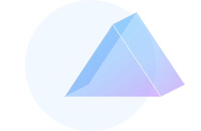

# Lumen: Ferramentas de Cores para a Web

<p align="center">
  
</p>

<p align="center">
  Uma plataforma de exploração de cores de alta performance, construída com Next.js e React, com um componente de roda de cores totalmente customizado.
</p>

<p align="center">
  
  
  
  
  
</p>

---

## 🎥 Demonstração

<p align="center">
  [INSERIR GIF DA RODA DE CORES EM AÇÃO]
</p>

## ✨ Funcionalidades

- **🎨 Roda de Cores Interativa**: Componente customizado usando Canvas com arraste global e precisão matemática
- **🔄 Conversão de Formatos**: Suporte completo a HEX, RGB, HSL e CMYK
- **📱 Interface Responsiva**: Layout moderno com sidebars para cores recentes e paletas salvas
- **🌙 Tema Claro/Escuro**: Alternância de temas com persistência
- **⚡ Alta Performance**: Roda 100% no navegador sem dependências pesadas

## ✨ Destaques Técnicos

O coração do Lumen é uma **roda de cores de alta performance**, construída do zero para superar as limitações de bibliotecas tradicionais:

- **Canvas Otimizado em Camadas**: Fundo estático e ponteiro em canvas sobreposto, garantindo redesenho mínimo e experiência **sem lag**.
- **Arraste Global**: O ponteiro pode ser arrastado fora dos limites do componente, como em softwares profissionais de design.
- **Precisão Matemática**: Conversão de coordenadas (x, y) para HSL usando cálculos diretos, evitando o uso de APIs pesadas como `getImageData`, que podem ser lentas no processamento..

## 🚀 Como Executar o Projeto

1. **Clone o repositório:**
    ```bash
    git clone https://github.com/seu-usuario/lumen.git
    cd lumen
    ```

2. **Instale as dependências:**
    ```bash
    npm install
    ```

3. **Execute o servidor de desenvolvimento:**
    ```bash
    npm run dev
    ```
    A aplicação estará disponível em [http://localhost:3000](http://localhost:3000).

## 🛠️ Stack de Tecnologia

- **Framework**: [Next.js 15.5.0](https://nextjs.org/)
- **Linguagem**: [TypeScript 5.x](https://www.typescriptlang.org/)
- **UI Library**: [React 19.1.0](https://reactjs.org/)
- **Estilização**: [TailwindCSS 4.x](https://tailwindcss.com/) (arquivo config mantido por compatibilidade)
- **Ícones**: [React Icons](https://react-icons.github.io/react-icons/)
- **Componentes de Cor**: [React Colorful](https://github.com/omgovich/react-colorful)
- **Renderização Gráfica**: HTML5 Canvas API

## 🚧 Próximos Passos

- [ ] **Funcionalidade Dinâmica nas Sidebars**: Implementar salvamento e carregamento de cores/paletas
- [ ] **Sistema de Persistência**: Adicionar localStorage ou integração com backend
- [ ] **Validação de Acessibilidade**: Implementar análise de contraste WCAG
- [ ] **Exportação de Paletas**: Suporte para exportar paletas em diferentes formatos
- [ ] **Ferramentas Avançadas**: Adicionar criação de gradientes e padrões

## ⚖️ Licença

Este projeto está licenciado sob a **MIT License**.
Veja o arquivo [LICENSE](./LICENSE) para mais detalhes.

---

<p align="center">
  Este projeto é um exemplo de construção de componentes de UI complexos e performáticos com React e Canvas.
</p>
