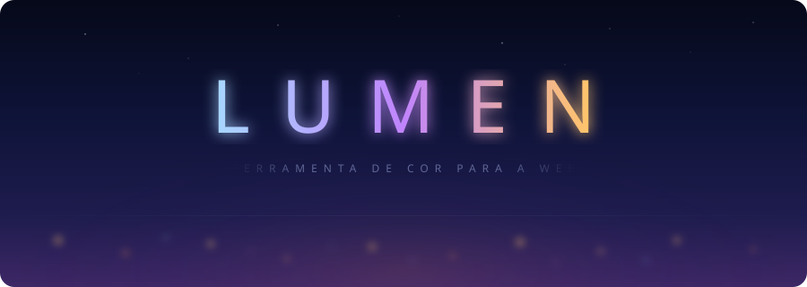

<div align="center">

<br>

<a href="https://lumen-ashy.vercel.app">
  
</a>

<br>

&nbsp;&nbsp;&nbsp;&nbsp;&nbsp;&nbsp;&nbsp;&nbsp;&nbsp;&nbsp;

<br><br>

Plataforma de seleção, análise cromática e exportação de tokens de cor.<br>
100% offline. Sem cadastro. Sem servidor. Persistência local via <code>localStorage</code>.

<br>

<a href="https://lumen-ashy.vercel.app"><b>Acessar&nbsp;&nbsp;→</b></a>

<br><br>

</div>


<br>

<table>
<tr>
<td width="50%" valign="top">

### Seletor Cromático
<sub>Disco contínuo de matiz e saturação com faders analógicos de brilho. Controle preciso no espaço HSV sem perdas por arredondamento.</sub>

</td>
<td width="50%" valign="top">

### Conversão Universal
<sub>HEX · RGB · HSL · CMYK — edição direta em qualquer modelo de cor com validação tolerante e cópia instantânea.</sub>

</td>
</tr>
<tr>
<td valign="top">

### Contraste WCAG
<sub>Verificação de acessibilidade em tempo real. Conformidade AA e AAA para texto normal e grande. Acessibilidade antes do deploy.</sub>

</td>
<td valign="top">

### Simulação de Daltonismo
<sub>Protanopia · Deuteranopia · Tritanopia · Acromatopsia — valide a inclusão visual do seu design.</sub>

</td>
</tr>
<tr>
<td valign="top">

### Harmonias Cromáticas
<sub>Análoga · Complementar · Dividida · Tríade · Monocromática — geração matemática com um clique.</sub>

</td>
<td valign="top">

### Paletas e Coleções
<sub>Crie, renomeie e organize coleções de cores. Histórico de recentes. Persistência local automática.</sub>

</td>
</tr>
<tr>
<td valign="top">

### Exportação de Tokens
<sub>CSS Variables · Tailwind v4 · JSON W3C DTCG · TypeScript — copie e cole direto no seu código.</sub>

</td>
<td valign="top">

### Cena Atmosférica
<sub>Chuva, reflexos de vidro e cidade noturna renderizados via Canvas a 60 fps. A estética é parte do instrumento.</sub>

</td>
</tr>
</table>

<br>


<br>

<details open>
<summary><b>&nbsp;&nbsp;Stack</b></summary>

<br>

| | |
|:---|:---|
| **Framework** | Next.js 15.5 · App Router · Turbopack |
| **Interface** | React 19.1 |
| **Linguagem** | TypeScript 5.x · Strict |
| **Estilização** | Tailwind CSS v4 · `@utility` customizados |
| **Estado** | Zustand v5 · `persist` · `localStorage` |
| **Cromática** | colord · A11y · CMYK · Harmonias |
| **Tipografia** | Figtree · IBM Plex Mono · `next/font` |
| **Qualidade** | ESLint 9 · 38 testes · 0 warnings |

</details>

<br>

<details>
<summary><b>&nbsp;&nbsp;Instalação</b></summary>

<br>

```bash
git clone https://github.com/Tenshiiz/lumen.git
cd lumen
npm install
npm run dev
```

<sub>Requer Node.js 18.17+</sub>

<br>

| Comando | Descrição |
|:---|:---|
| `npm run dev` | Servidor de desenvolvimento |
| `npm run build` | Build de produção |
| `npm run lint` | Análise estática |
| `npm test` | Suíte de testes unitários |

</details>

<br>


<br>

<div align="center">

<sub>Licença [MIT](./LICENSE)</sub>

<br><br>

<samp>Construído com precisão.</samp>

<br><br>

</div>
